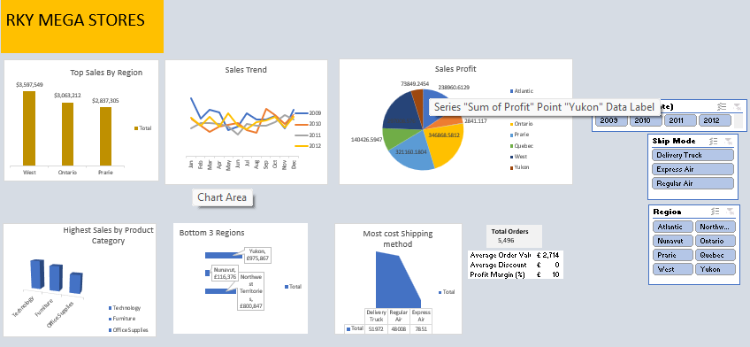

# Retail Sales Management Analysis

## Project Overview

This project presents a comprehensive sales analysis of retail transaction data using Microsoft Excel. The objective was to transform raw sales data into meaningful insights that support business decision-making. Through data cleaning, Pivot Tables, Pivot Charts, KPIs, and an interactive dashboard, the analysis identifies sales trends, customer behavior, product performance, and regional profitability.

---

## Business Problem

Retail businesses generate large volumes of transactional data, making it difficult to identify key performance drivers without proper analysis. This project aims to answer the following business questions:

- Which product categories generate the highest sales and profit?
- Which regions contribute the most revenue?
- How do customer segments impact business performance?
- What trends can be identified from historical sales data?
- How can the business improve profitability and reduce losses?

---

## Dataset Information

The dataset contains retail sales transactions, including:

- Order Information
- Customer Details
- Product Categories and Sub-Categories
- Sales Revenue
- Profit
- Discounts
- Shipping Information
- Regional Performance

---

## Tools Used

- Microsoft Excel
- Pivot Tables
- Pivot Charts
- Slicers
- Conditional Formatting
- Dashboard Design

---

## Data Cleaning Process

The following steps were performed before analysis:

- Checked for duplicate records
- Verified data consistency and accuracy
- Standardized formats where necessary
- Validated missing values
- Created calculated fields for reporting
- Organized data for dashboard development

---

## Key Performance Indicators (KPIs)

The dashboard tracks:

- Total Sales
- Total Profit
- Total Orders
- Sales by Category
- Sales by Region
- Sales by Customer Segment
- Product Performance
- Profitability Trends

---

## Dashboard Preview

Add your dashboard screenshot to the screenshots folder and insert it below:

```markdown

```

---

## Key Insights

- Technology products generated the highest sales revenue.
- Certain regions consistently outperformed others in sales and profitability.
- Consumer and Corporate customer segments contributed significantly to overall revenue.
- Product performance varied across categories, highlighting opportunities for inventory optimization.
- Sales trends revealed periods of high and low business activity that can support future planning.

---

## Recommendations

- Increase investment in top-performing product categories.
- Develop targeted marketing strategies for high-value customer segments.
- Monitor underperforming products and regions.
- Optimize pricing and discount strategies to improve profit margins.
- Use historical sales trends to improve forecasting and inventory management.

---

## Skills Demonstrated

- Data Cleaning
- Data Analysis
- Data Visualization
- Dashboard Development
- Business Intelligence
- KPI Reporting
- Microsoft Excel
- Analytical Thinking
- Business Problem Solving

---

## Project Outcome

This project demonstrates how Excel can be used to convert raw business data into actionable insights through effective analysis and visualization. The resulting dashboard provides stakeholders with a clear view of sales performance, customer behavior, and business opportunities, enabling data-driven decision-making.

---

## Author

**Augustine Daniel**

Aspiring Data Analyst | Excel | SQL | Power BI | Data Visualization

GitHub: Add your GitHub profile link here

LinkedIn: Add your LinkedIn profile link here
